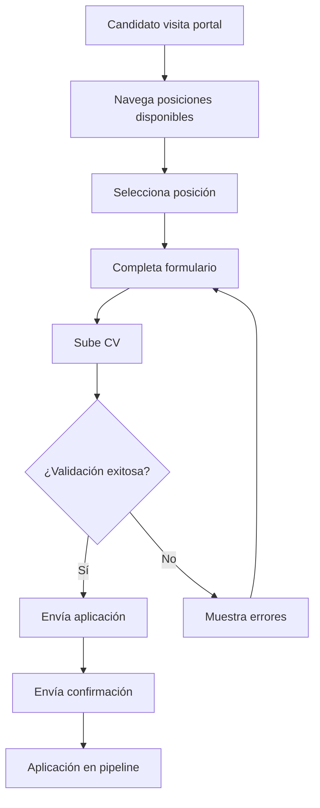
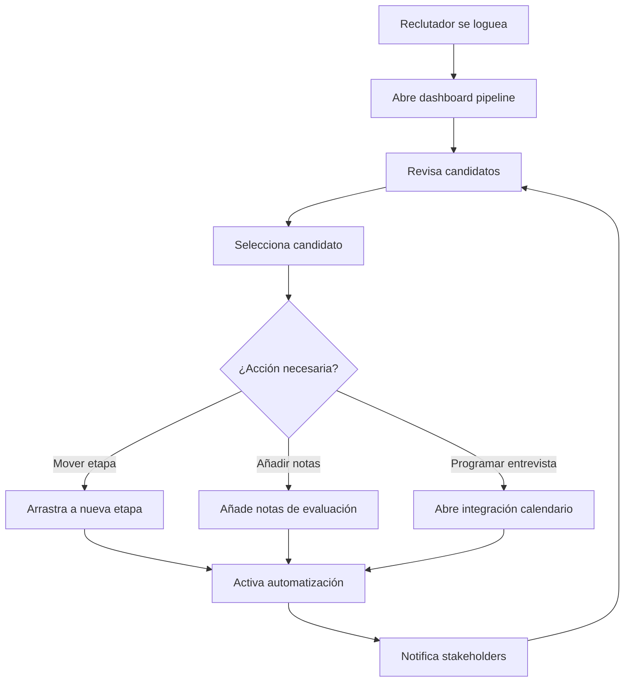
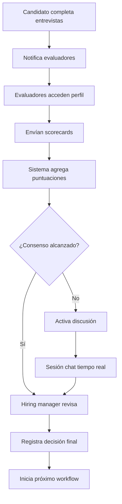
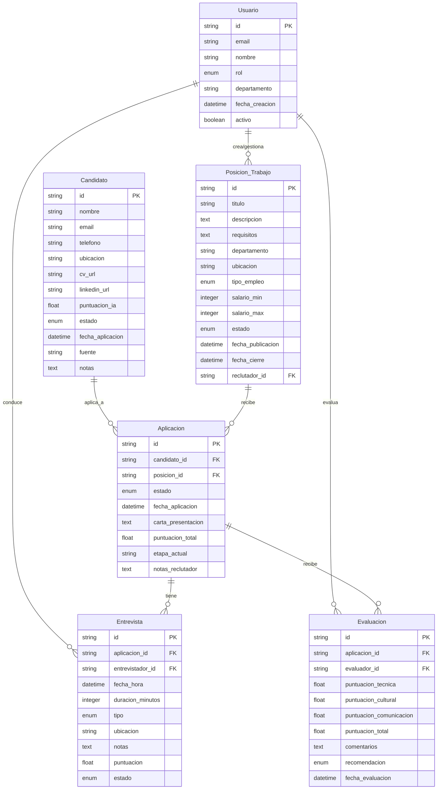
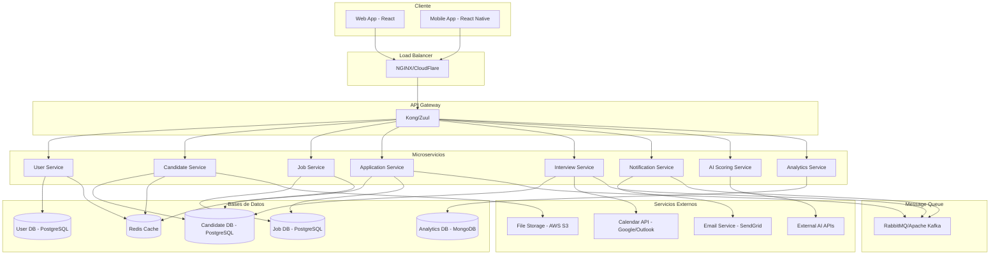
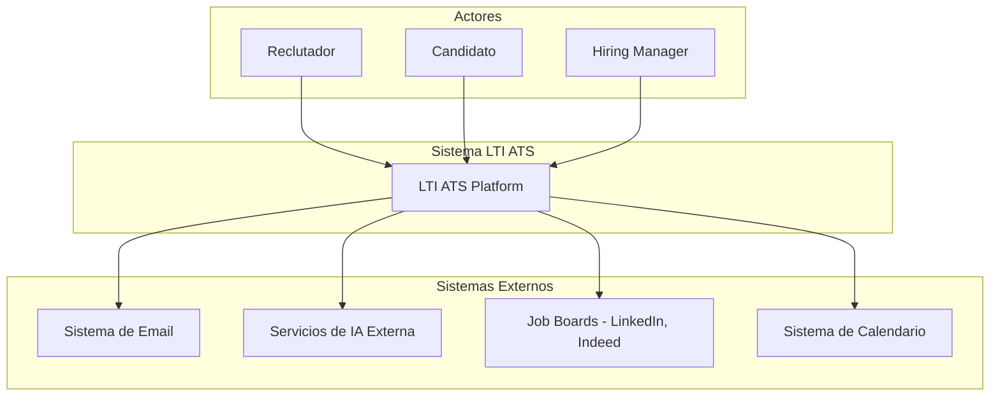
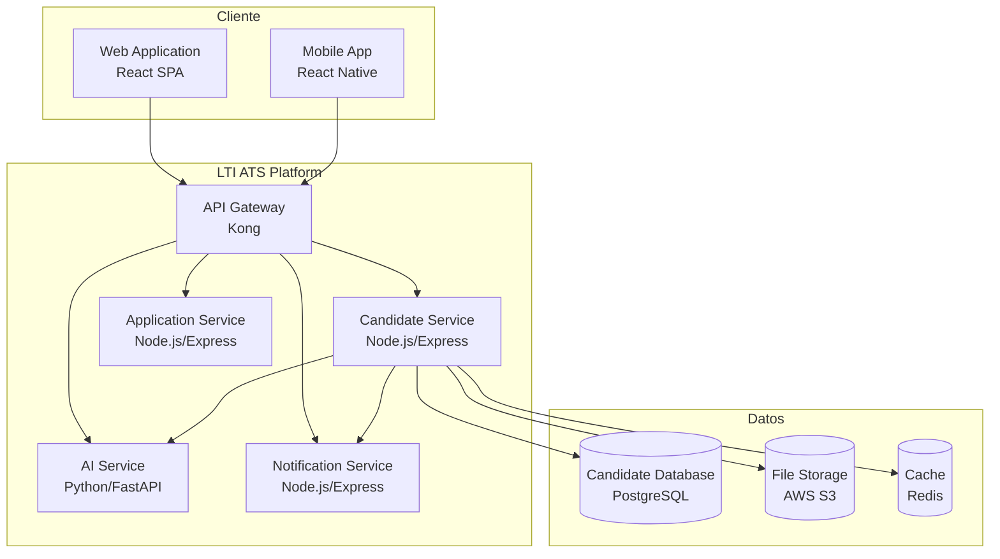
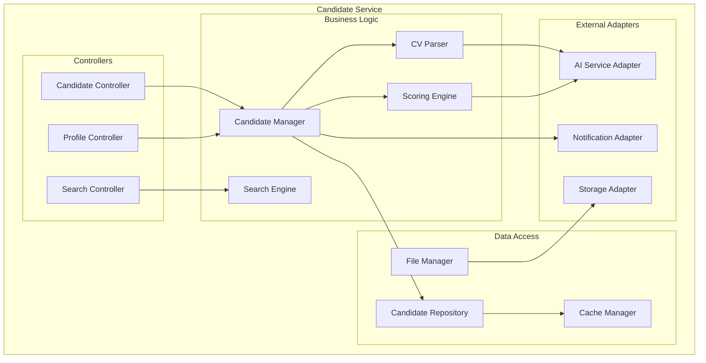

# LTI-GG - Applicant Tracking System del Futuro

## 📋 Tabla de Contenidos

1. [Descripción del Sistema](#descripción-del-sistema)
2. [Lean Canvas](#lean-canvas)
3. [Casos de Uso Principales](#casos-de-uso-principales)
4. [Modelo de Datos](#modelo-de-datos)
5. [Diseño de Alto Nivel](#diseño-de-alto-nivel)
6. [Diagrama C4](#diagrama-c4)

---

## 🚀 Descripción del Sistema

### ¿Qué es LTI-GG?

LTI-GG (Leading Talent Intelligence - Global Generation) es una plataforma de nueva generación para la gestión de talento que revoluciona el proceso de reclutamiento mediante inteligencia artificial, automatización inteligente y experiencia de usuario superior.

### 💡 Valor Añadido

- **IA Predictiva**: Motor de inteligencia artificial que predice el éxito de candidatos basado en patrones históricos y análisis comportamental
- **Automatización Inteligente**: Flujos de trabajo que se adaptan dinámicamente según el tipo de posición y perfil del candidato
- **Experiencia Unificada**: Portal único que conecta candidatos, reclutadores y hiring managers en tiempo real
- **Analytics Avanzados**: Dashboard predictivo con métricas de rendimiento y recomendaciones de optimización
- **Diversidad e Inclusión**: Herramientas integradas para promover contratación diversa y eliminar sesgos inconscientes

### 🏆 Ventajas Competitivas

1. **Motor de IA Pre-entrenado**: No requiere configuración inicial, aprende de patrones exitosos desde el día uno
2. **Arquitectura Cloud-Native**: Escalabilidad automática y disponibilidad 99.9% garantizada
3. **Integración Ecosistémica**: Conectividad nativa con +50 plataformas de HR, job boards y herramientas de evaluación
4. **Mobile-First Design**: Optimizado para reclutadores que trabajan en movimiento con apps nativas iOS/Android
5. **Transparencia Total**: Modelo de precios por uso con visibilidad completa de costos y ROI

### 🎯 Funciones Principales

- **Pipeline Inteligente**: Gestión visual con recomendaciones automáticas de próximos pasos
- **Sourcing Automatizado**: Búsqueda proactiva de candidatos en múltiples canales con matching inteligente
- **Evaluación 360°**: Sistema de evaluación colaborativa con calibración automática entre evaluadores
- **Scheduling AI**: Coordinación automática de entrevistas con optimización de agendas y preferencias
- **Candidate Experience Hub**: Portal personalizado para candidatos con seguimiento en tiempo real

---

## 📊 Lean Canvas

```
┌─────────────────────────────────────────────────────────────────────────────────┐
│                                LTI ATS LEAN CANVAS                             │
├─────────────────┬─────────────────┬─────────────────┬─────────────────────────────┤
│ PROBLEMA        │ SOLUCIÓN        │ PROPUESTA DE    │ VENTAJA INJUSTA             │
│                 │                 │ VALOR ÚNICA     │                             │
│ • Screening     │ • IA para       │ El único ATS    │ • Experiencia en startups   │
│   manual de CVs │   evaluación    │ que combina     │   tech y reclutamiento      │
│ • Experiencia   │   automática    │ colaboración    │ • Algoritmos propietarios   │
│   pobre del     │ • Colaboración  │ en tiempo real  │   de IA                     │
│   candidato     │   en tiempo     │ con automatiza- │ • Partnerships estratégicos │
│ • Decisiones    │   real          │ ción de IA      │   con universidades tech    │
│   sesgadas      │ • Diseño        │ libre de sesgos │ • First-mover en IA         │
│ • Herramientas  │   mobile-first  │                 │   colaborativa              │
│   fragmentadas  │ • Integraciones │                 │                             │
│                 │   inteligentes  │                 │                             │
├─────────────────┼─────────────────┴─────────────────┼─────────────────────────────┤
│ MÉTRICAS CLAVE  │ CANALES                           │ SEGMENTOS DE CLIENTES       │
│                 │                                   │                             │
│ • Time-to-hire  │ • Venta directa (enterprise)      │ • Departamentos de HR       │
│ • Quality of    │ • Content marketing (SEO/blog)    │   (50-500 empleados)        │
│   hire score    │ • Partnerships con consultoras HR │ • Startups en crecimiento   │
│ • Adopción de   │ • Product Hunt y comunidades tech │ • Agencias de reclutamiento │
│   usuarios      │ • LinkedIn y social selling       │ • Empresas remote-first     │
│ • Revenue per   │ • Programa de referidos           │ • Scale-ups tecnológicas    │
│   customer      │                                   │                             │
│                 │                                   │                             │
├─────────────────┴───────────────────────────────────┼─────────────────────────────┤
│ ESTRUCTURA DE COSTOS                                │ FUENTES DE INGRESOS         │
│                                                     │                             │
│ • Equipo de ingeniería (60%)                       │ • Suscripción SaaS          │
│ • Infraestructura cloud (15%)                      │   (€50/reclutador/mes)      │
│ • Ventas y marketing (20%)                         │ • Features premium de IA    │
│ • Legal y compliance (5%)                          │   (€20/reclutador/mes)      │
│                                                     │ • Servicios de implementa-  │
│                                                     │   ción (€5,000 una vez)     │
│                                                     │ • Paquete de analytics      │
│                                                     │   (€10/reclutador/mes)      │
└─────────────────────────────────────────────────────┴─────────────────────────────┘
```

---

## 📋 Casos de Uso Principales

### Caso de Uso 1: Aplicación de Candidato

**Actor**: Candidato a empleo  
**Objetivo**: Enviar aplicación para una posición de trabajo  
**Precondiciones**: La oferta de trabajo está publicada y disponible

**Flujo Principal**:

1. El candidato navega por las posiciones disponibles
2. El candidato selecciona una posición de interés
3. El sistema muestra detalles del trabajo y formulario de aplicación
4. El candidato completa información personal y sube su CV
5. El sistema valida los datos de la aplicación
6. El sistema confirma el envío exitoso
7. El sistema envía email de confirmación al candidato

**Flujos Alternativos**:

- 4a. Parsing del CV falla → El sistema solicita entrada manual de datos
- 5a. Validación falla → El sistema resalta errores y solicita corrección

**Postcondiciones**: La aplicación se almacena en el sistema y entra en screening inicial



### Caso de Uso 2: Gestión de Pipeline por Reclutador

**Actor**: Reclutador  
**Objetivo**: Gestionar candidatos a través de las etapas del pipeline de contratación  
**Precondiciones**: El reclutador está autenticado y tiene candidatos asignados

**Flujo Principal**:

1. El reclutador abre el dashboard del pipeline
2. El sistema muestra candidatos organizados por etapas del pipeline
3. El reclutador revisa perfiles y CVs de candidatos
4. El reclutador mueve candidatos entre etapas (drag & drop)
5. El sistema activa acciones automatizadas según transiciones de etapa
6. El reclutador añade notas y puntuaciones a perfiles de candidatos
7. El sistema guarda todos los cambios y notifica a stakeholders relevantes

**Flujos Alternativos**:

- 4a. Transición de etapa requiere aprobación → Sistema envía notificación a hiring manager
- 6a. Reclutador programa entrevista → Sistema integra con calendario

**Postcondiciones**: Estado del candidato actualizado, stakeholders notificados



### Caso de Uso 3: Evaluación Colaborativa de Candidatos

**Actor**: Hiring Manager, Reclutador, Panel de Entrevistas  
**Objetivo**: Evaluar colaborativamente y tomar decisiones de contratación  
**Precondiciones**: El candidato ha completado el proceso de entrevistas

**Flujo Principal**:

1. El sistema notifica a todos los evaluadores cuando el candidato llega a etapa de evaluación
2. Cada evaluador accede al perfil completo del candidato
3. Los evaluadores envían scorecards individuales y feedback
4. El sistema agrega puntuaciones e identifica consenso/conflictos
5. El hiring manager revisa la evaluación agregada
6. El equipo discute discrepancias en chat en tiempo real
7. Se registra la decisión final de contratación
8. El sistema inicia workflow de oferta/rechazo

**Flujos Alternativos**:

- 4a. Las puntuaciones muestran discrepancia significativa → Sistema activa fase de discusión
- 7a. La decisión se aplaza → Sistema programa reunión de seguimiento

**Postcondiciones**: Decisión de contratación registrada, próximos pasos iniciados



---

## 🗄️ Modelo de Datos

### Entidades Principales

#### Usuario

- **id**: String (PK)
- **email**: String (único)
- **nombre**: String
- **rol**: Enum (Reclutador, HiringManager, Admin)
- **departamento**: String
- **fecha_creacion**: DateTime
- **activo**: Boolean

#### Candidato

- **id**: String (PK)
- **nombre**: String
- **email**: String (único)
- **telefono**: String
- **ubicacion**: String
- **cv_url**: String
- **linkedin_url**: String
- **puntuacion_ia**: Float
- **estado**: Enum (Aplicado, Screening, Entrevista, Evaluacion, Contratado, Rechazado)
- **fecha_aplicacion**: DateTime
- **fuente**: String
- **notas**: Text

#### Posicion_Trabajo

- **id**: String (PK)
- **titulo**: String
- **descripcion**: Text
- **requisitos**: Text
- **departamento**: String
- **ubicacion**: String
- **tipo_empleo**: Enum (FullTime, PartTime, Contrato, Practicas)
- **salario_min**: Integer
- **salario_max**: Integer
- **estado**: Enum (Borrador, Publicada, Pausada, Cerrada)
- **fecha_publicacion**: DateTime
- **fecha_cierre**: DateTime
- **reclutador_id**: String (FK → Usuario)

#### Aplicacion

- **id**: String (PK)
- **candidato_id**: String (FK → Candidato)
- **posicion_id**: String (FK → Posicion_Trabajo)
- **estado**: Enum (Pendiente, Revisando, Entrevista, Evaluacion, Oferta, Contratado, Rechazado)
- **fecha_aplicacion**: DateTime
- **carta_presentacion**: Text
- **puntuacion_total**: Float
- **etapa_actual**: String
- **notas_reclutador**: Text

#### Entrevista

- **id**: String (PK)
- **aplicacion_id**: String (FK → Aplicacion)
- **entrevistador_id**: String (FK → Usuario)
- **fecha_hora**: DateTime
- **duracion_minutos**: Integer
- **tipo**: Enum (Telefonica, Presencial, VideoLlamada, Tecnica)
- **ubicacion**: String
- **notas**: Text
- **puntuacion**: Float
- **estado**: Enum (Programada, Completada, Cancelada, Reprogramada)

#### Evaluacion

- **id**: String (PK)
- **aplicacion_id**: String (FK → Aplicacion)
- **evaluador_id**: String (FK → Usuario)
- **puntuacion_tecnica**: Float
- **puntuacion_cultural**: Float
- **puntuacion_comunicacion**: Float
- **puntuacion_total**: Float
- **comentarios**: Text
- **recomendacion**: Enum (Contratar, Rechazar, Indecisos)
- **fecha_evaluacion**: DateTime

### Relaciones



---

## 🏗️ Diseño de Alto Nivel

### Arquitectura General

El sistema LTI está diseñado con una arquitectura moderna de microservicios que prioriza la escalabilidad, mantenibilidad y experiencia del usuario.



### Componentes Principales

#### Frontend

- **Web Application**: React SPA con TypeScript para máxima mantenibilidad
- **Mobile Application**: React Native para iOS/Android con funcionalidad offline
- **Admin Dashboard**: Panel de administración con analytics avanzados

#### Backend Services

- **User Service**: Autenticación, autorización, gestión de perfiles
- **Candidate Service**: CRUD de candidatos, parsing de CVs, scoring con IA
- **Job Service**: Gestión de posiciones, publicación automática, matching
- **Application Service**: Pipeline de aplicaciones, workflows automatizados
- **Interview Service**: Programación, gestión de calendarios, feedback
- **Notification Service**: Emails, SMS, push notifications
- **AI Service**: Scoring de candidatos, análisis de CVs, predicciones
- **Analytics Service**: Métricas, reportes, dashboard ejecutivo

#### Persistencia

- **PostgreSQL**: Datos transaccionales (usuarios, candidatos, jobs)
- **MongoDB**: Analytics y datos no estructurados
- **Redis**: Cache y sesiones
- **AWS S3**: Almacenamiento de archivos (CVs, documentos)

#### Integraciones

- **Email**: SendGrid para notificaciones automáticas
- **Calendar**: Google Calendar/Outlook para programación de entrevistas
- **Job Boards**: LinkedIn, Indeed, Glassdoor para publicación automática
- **Video**: Zoom/Teams para entrevistas remotas

### Principios Arquitectónicos

1. **Microservicios**: Servicios independientes y desplegables por separado
2. **API-First**: Todas las funcionalidades expuestas vía APIs REST
3. **Event-Driven**: Comunicación asíncrona vía message queues
4. **Cloud-Native**: Diseñado para contenedores y Kubernetes
5. **Security-First**: OAuth 2.0, encriptación end-to-end, auditoría completa

---

## 🔍 Diagrama C4 - Candidate Service

### Nivel 1 - Contexto del Sistema



### Nivel 2 - Contenedores



### Nivel 3 - Componentes del Candidate Service



### Nivel 4 - Código del CV Parser

```typescript
// CV Parser Component - Responsible for extracting structured data from CVs

class CVParser {
  private aiService: AIServiceAdapter;
  private fileValidator: FileValidator;

  async parseCV(fileBuffer: Buffer, fileName: string): Promise<ParsedCVData> {
    // Validate file format and size
    await this.fileValidator.validate(fileBuffer, fileName);

    // Extract text from various formats (PDF, DOC, DOCX)
    const extractedText = await this.extractText(fileBuffer, fileName);

    // Use AI service to extract structured data
    const structuredData = await this.aiService.extractCVData(extractedText);

    // Validate and clean extracted data
    const cleanedData = this.validateAndCleanData(structuredData);

    return cleanedData;
  }

  private async extractText(buffer: Buffer, fileName: string): Promise<string> {
    const extension = path.extname(fileName).toLowerCase();

    switch (extension) {
      case ".pdf":
        return await this.extractFromPDF(buffer);
      case ".doc":
      case ".docx":
        return await this.extractFromWord(buffer);
      case ".txt":
        return buffer.toString("utf-8");
      default:
        throw new UnsupportedFileFormatError(extension);
    }
  }

  private validateAndCleanData(data: any): ParsedCVData {
    return {
      personalInfo: this.cleanPersonalInfo(data.personalInfo),
      experience: this.cleanExperience(data.experience),
      education: this.cleanEducation(data.education),
      skills: this.cleanSkills(data.skills),
      confidence: data.confidence || 0.0,
    };
  }
}

interface ParsedCVData {
  personalInfo: {
    name: string;
    email: string;
    phone?: string;
    location?: string;
    linkedIn?: string;
  };
  experience: WorkExperience[];
  education: Education[];
  skills: string[];
  confidence: number;
}
```

### Responsabilidades del Candidate Service

1. **Gestión de Perfiles**: CRUD completo de información de candidatos
2. **Parsing de CVs**: Extracción automática de datos estructurados
3. **Scoring con IA**: Evaluación automática basada en requisitos del puesto
4. **Búsqueda Avanzada**: Filtros complejos y búsqueda por similitud
5. **Gestión de Archivos**: Upload, storage y versionado de documentos
6. **Notificaciones**: Integración con sistema de notificaciones
7. **Cache**: Optimización de consultas frecuentes
8. **Auditoría**: Logging de todas las operaciones para compliance